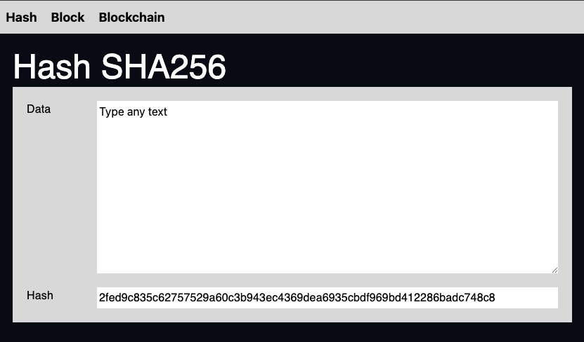
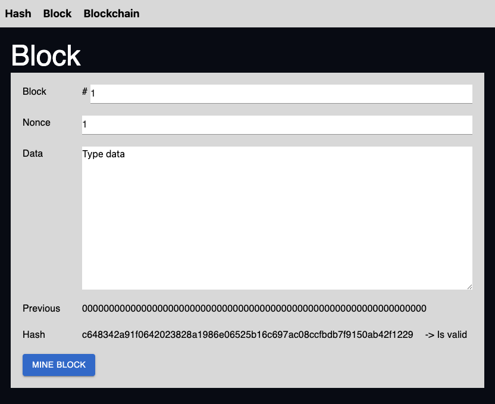
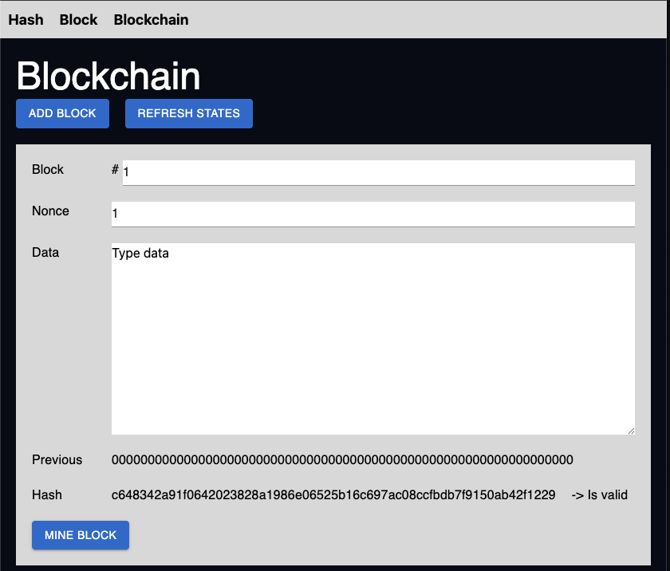

# Simple Blockchain Example

Simple implementation of a minimalist blockchain.

## Locally run

```bash
npm install
npm run dev
```

Your application will be available at `http://localhost:5173`.

To build and run using Docker:

```bash
docker build -t my-app .

# Run the container
docker run -p 3000:3000 my-app
```

## Pages






